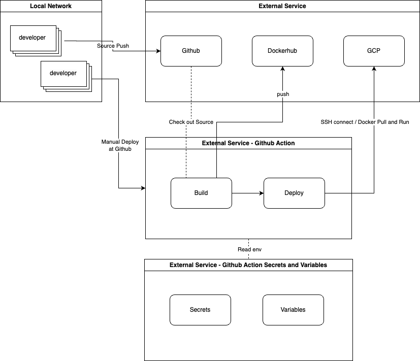

# Eco Picker API

## Prerequisites

- JDK 17 or higher
- Gradle
- IDE (IntelliJ IDEA recommended)

## Getting Started

### git clone

```shell
git clone https://github.com/Eco-Picker/eco-picker-api.git
cd eco-picker-api
```

### set an env file

```shell
cp .env.example .env
```

After copying, you need to update the .env file with your specific credentials.
Particularly, ensure that the following section is properly configured:

```shell
GEMINI_APP_KEY={GEMINI_APP_KEY}
SMTP_USERNAME={SMTP_USERNAME}
SMTP_PASSWORD={SMTP_PASSWORD}
DB_URL={DB_URL}
DB_USERNAME={DB_USERNAME}
DB_PASSWORD={DB_PASSWORD}
```

### build

```shell
./gradlew build 
```

## [Optional] Docker-compose for mysql

- ✅ check environment at docker-compose.yml
- ✅ check if your local port is occupied

```shell
cd docker
docker-compose up -d 
```

### bootRun

```shell
./gradlew bootRun
```

### Swagger

- [local] http://localhost:15000/api/swagger-ui/index.html
- [production] https://eco-picker.com/api/swagger-ui/index.html

### Health Check

- [local] http://localhost:15000/api/actuator/health
- [production] https://eco-picker.com/api/actuator/health

## Flowcharts

### Infrastructure Architecture

> The following diagram illustrates the infrastructure setup for the application, including the integration with
> Cloudflare, GCP, AWS, and external APIs:


### CI/CD Architecture



## License

This project is licensed under the MIT License - see the LICENSE file for details.

Contact
For any questions or feedback, please contact

- [jerry2219398\@gmail.com](mailto:jerry2219398@gmail.com?subject=ecopicker)
- [jsunwoo0977\@gmail.com](mailto:jsunwoo0977@gmail.com?subject=ecopicker)
